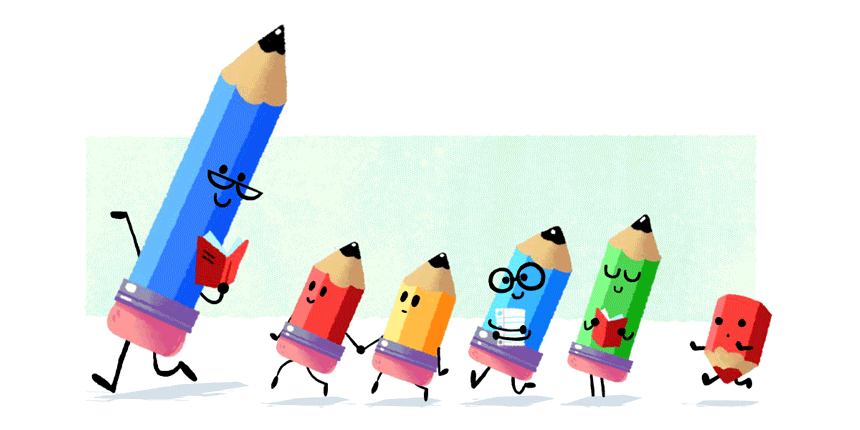
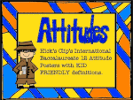

# Welcome to My Teaching Portfolio

## Table of Contents

### [About me](#about-me-1)

### [Teaching Philosophy](#teaching-philosophy-1)

### [Teaching and Learning](#teaching-and-learning-1)

### [Professional Learning and Future Growth](#professional-learning-and-future-growth-1)
  
### [Honors](#honors-1)
  
### [Associations](#associations-1)

### [Appendix](#appendix-1)

### About me

I am passionate about innovative teaching methodology with a student-centered approach. I have about 10 years of experience strategizing effective learning experiences for students from preschoolers to adults in the _transdisciplinary approach_.

I grew up in a coastal city in southeast China, and am an avid STEAM course developer, and a fan of music, jazz and hip pop choreography, and traditional Chinese martial arts.

1.1 Transdisciplinary Projects and Hobbies

1.1.1 3D Printing Project (STEAM)

1.1.2 Assembled Mechanic Ox-cart - a Chinese Ancient Transport Vehicle (STEAM)

1.1.3 English Music Class with a Piano Software (Lieracy, Music and Technology)

1.1.4 Dance Warm-Up (Literacy, Music and Dance)

1.1.5 Jazz Dance Contest (Coordination Skills, Communication Skills, Dance and Music)

1.1.6 An Interpreter for a Conductor of the Vienna Concert Hall during a Vocal Training Session at the Music Academy of Xiamen University (Music, Receptive and Productive Skills, Communication Skills)

1.2 Self-introduction Video

<https://pan.baidu.com/s/1NXFWdyt5QRb5x3h4k30Kxw?pwd=1234>

1.3 Curriculum Vitae (Appendix)

#### _Back to the table of contents_ [↩](#table-of-contents)

  

### Teaching Philosophy

 

My preliminary understanding of teaching philosophy is about the _student-centered methodology.

When I began to study the first course for the IB educator certificate in the early 2021, I aligned my earlier practice with the _humanistic approach_ that emphasizes students' interest and engagement as key elements in effective learning and teaching.

Then earlier this year, through the further study of the first MEd. course on educational context, including educational philosophy, history and sociology, I have aligned my years of practice with John Dewey's _progressivism_, Freire Paulo's _critical pedagogy_, and _humanism_, especially the _new humanism_ proposed by UNESCO aiming to integrate the western humanism with the eastern counterpart, complying with IB mission to "develop internationally minded people who, recognizing their common humanity and shared guardianship of the planet, help to create a better and more peaceful world", based on intercultural understanding and mutual respect.

<https://southwest.mpls.k12.mn.us/uploads/screen_shot_2014-04-10_at_2_50_11_pm.png>

The journey of inquiry about my teaching philosophy turns out impactful for the rest of my life and those I know that would like to become part of IB's global community. Please spare me a few minutes to talk about my story of inquiry.

References:

IBO, 2018, _PYP The Learner_

2.1 The Period of Self-awareness (2012-2013)

After working in foreign trade of OEM products such as sensors and cables for ABB industrial robot arms for six years, I started my teaching career in quest of my own potential, freedom, identity, and a meaningful life. I chose not to work in a public school after I acquired an English teaching certificate for high school because of insufficient networking and possible restrictions on teaching at a public school. Thus I chose to work in the private sector which served middle-class families in particular. Beginning from IELTS and TOEFL examination technique preparation, I tried to look for a job that was irreplaceable, unlike the previous ones I got as a deputy general manager or a foreign trade manager. Then I began to realize that something was wrong, after witnessing students’ struggle against exam-oriented education and resentment of English learning. It has prompted me with a long journey to inquire about students’ early-year experiences for their typical problems in their later life, and the most important of all, the effective methods to cultivate students’ interest for English learning.

[ABB robot arms](https://robotsdoneright.com/ABB/100-Series/ABB-IRB-120.html)

-_How English testing is failing Chinese students by driving numbers, not proficiency_

<https://www.scmp.com/comment/insight-opinion/united-states/article/2177403/how-english-testing-failing-chinese-students>)

2.2 The Period of Practice & Collaboration (2014-2017)

The journey began when I got an offer as an ESL teacher from _English First_, a world-renowned education group based in Sweden, a country famous for its student-centered K-12 education system. After struggling for about two months observing teachers down-the-hall, attending routine workshops, and learning by doing such as managing classes of early learners, preparing related lessons, assisting co-teachers, I started to take initiative in incorporating my interest with students’ into lesson planning, and adapting or creating new activities depending on the context. I think my practice have shown consistent evidence for the IB pedagogy on the _transdisciplinary_ nature in language teaching, especially _project-based learning_ with _differentiated rewards_ designed for topics in the curriculum, serving multiple purposes such as _provocations_, project models, _positive reinforcement_, and more opportunities for the drill of _productive skills_. The _hands-on approach_ has been well developed since then.

2.2.1 EF 50th Anniversary Party

Based on my childhood experience with my mom who taught me how to make origami toys, I understood that students would love this hands-on approach, so I incorporated it into lesson planning, which aimed to develop children's understanding of lines and symmetrical shapes, related to story characters and new vocabularies such as animals, clothes and home furniture. Sometimes parents would help their small children with some steps. They were always welcome to attend our classes and activities. The involvement of parents faciliated student learning and built a strong connection among students, parents and the school. I would say the _humanistic approach_ I have adopted based on students’ interest, _agency_, _self-efficacy_, and the _learning community_ has prepared me to “internalize” IB methodology, according to my IB instructors.

2.2.2 Origami Animals for Puppetry Theater and Rewards (2-4 years old) (Literacy, Natural Science, Math)

2.2.3 Movable Origami Monkey for Grammar Drill (6-7 years old)

The project was developed for both receptive and productive skills. Students learned to say the prepositional phrases and sentence patterns of positions while being engaged with the movable origami monkey. Grammar has been the most painful learning experience for early learners with their logic thinking still developing, so the hands-on transdisciplinary approach fostered students' interest in learing grammar, avoiding the most-used tedious drills. When students completed their own projects, they practice _productive skills_ with a sense of achievement boosting their _self-efficacy_, and in turn, enhancing their _agency_.  

2.2.4 2D Shapes Developed into 3D Projects (3-5 years old)

The projects were for an unit of 2D shapes from _Journeys_ , a famous reading program for grades K-6 published by Houghton Mifflin Harcourt. In order for preschoolers to inquire about the shapes and their attributes with a hands-on approach, I developed the projects as models for students to talk about what they could build with the shapes, connecting with their _prior knowledge_ of flowers, arts, handicraft (wind chime), and robot toys.

2.2.5 Children's Day Gathering

Families were invited to join our celebration of Children's Day that has been the happiest day of children in the year. Shows were put on in an exhibition style. All children learned something from the center, and their parents felt very proud of it.

- Children Singing English Songs on the Stage

<https://pan.baidu.com/s/1OiC44qT9WDvkbjY8A6POQg?pwd=1234>

2.2.6 Weekly Life Club: teachers take turns to host the life club in different themes at the big kitchen with a projector, a screen and a host computer, so that students could take related classes and prepare snack food.

Apart from my major responsibility to deliver innovative classes to early learners, I shared my ideas of teaching with colleagues through small talk, workshops and teaching materials archived in our class portfolio. I was also a problem solver, for example, covering sick colleagues' classes on short notice with equal quality and impression on students whom I met for the first time (because the students recognized me on the street). I think it took courage, flexibility, charm, and improvisatory quality to tackle emergency like this. Being sort of a tech geek, I also helped setting up a home router for a new comer from the USA.

As an empathetic teacher, I extended concerns for low-achievers and trouble makers by listening carefully to them, responding actively, and helping individual students with their social and emotional well-being. This, I suppose, is the epitome of _inclusion education_.

2.3 The Period of Collaboration and Leadership (2017-now)

I have been in charge of _curriculum development_ and teaching faculty since I started working in day-care centers for preschoolers and primary students. I also made prototypes for teachers to decorate their classrooms, sampled photoframes for students' headshots, gave teaching ideas for their projects based on picture books and topics in the curriculum, and organized events such as life club, STEAM club, holiday celebrations, puppetry theater for marketing, and parental meetings.

2.3.1 Picture Book Projects

The book is about a birthday party from _Oxford Reading Tree_ with an ort program to operate on the computer. Apart from using the interactive white board with the program, we used the project-based approach to engage early learners based on different teacher strengths. The idea of mango slices arranged in the shape of a birthday cake with letter-shaped biscuits was co-deveoped by the team. The white board decorated with balloons and laminated letter cards served as a setting for early learners to put on a puppet show in the same theme. Multiple projects were initiated by different teachers. Their ideas were also great inspirations for me. I believed the achievements by teamwork had a significant advantage over those by individuals.

2.3.2 Puppetry Show for Marketing

This show was organized for the marketing department targeting the age group from toddlers to lower-primary students. We first created a forest setting with cardboards, drawings and glue gun. Then teachers were paired to put on one mini-show, keeping in mind effective interaction with the audience. A section was designed for children volunteers to take part in the show with English expressions learned on the spot.

2.3.4 Bilingual Day-care Centers

* Xiamen in Southeast China

Children had meals and snacks in the centers.

- A 2.5-year-old boy was learning a color song with props.

<https://pan.baidu.com/s/1Da6VheW6uYmRM2b2pMOocA?pwd=1234>

- A 3-year-old girl was reading a picture book with me.

<https://pan.baidu.com/s/1YYt32VXwm7n34IPH_XEtOA?pwd=1234>

We were having a whisper game in small-group competition for primary students.

* Shenzhen in South China

Circle Time with Toddlers, Parents, and Teachers

Toddlers were "talking" about a picture book.

<https://pan.baidu.com/s/1UK7bF0RR20NBNO-57Pk5Yw?pwd=1234>

2.4 The Period of Identity Establishment (2021- now)

During the journey of inquiry about my own identity, effective learning, and solutions to students' learning difficulties, I came across IB education by searching online forums for professional development when I saw a post by an experienced IB teacher in Shanghai introducing the differences and strengths of international education systems. I decided to sign up for the IB educator certificate after that and set forth for a brand new learnng journey that has opened my eyes with the biggest learning impact I have ever had. Connecting with my previous experience, I have found so large an amount of resonance in IB philosophical cornerstones and methodology.

Here is an example.

In my teaching experience with students from toddlers to adults in a second-tier city and a first-tier one, I have seen anxiety and pressure overwhelming students preparing for exams, and a lot of joy and freedom enlivening children studying for interest, excitement, and sense of accomplishment. I used to believe my teaching philosophy as western-style for my professional training acquired in a franchised training center with a Europe-based curriculum and EFL approaches to teaching. When I encountered a situation where my superior, as an experienced English teacher, dragged away a disobedient 6-year-old trouble-maker during a novice teacher’ class at a private training center in a top-tier city in south China in 2020, I thought there would never be an agreement between western educational philosophy and traditional Chinese counterpart because these two sets of long-existing educational systems were exclusive of each other. I somehow solved the problems of classroom management with _positive discipline_ (Dr. Nelsen) two months after I took over the class when there was considerable improvement of the boy in discipline, cooperative learning, autonomous leadership, and initiative in learning.

<https://www.amazon.com/Positive-Discipline-Jane-Nelsen-EdD-audio/dp/B076FJJHC1/ref=sr_1_1?crid=3DV5SL4XHPVKH&keywords=positive+discipline&qid=1659363342&sprefix=%2Caps%2C1290&sr=8-1>

Therefore, I thought the western humanism with an emphasis on “human freedom, natural goodness, human growth and potential, personal and social values” (Sharpes, 2013, p.158) triumphed over the traditional Chinese philosophy which emphasized teacher authority and student obedience. Then I saw the possibility to integrate the two philosophies when I read George Walker’s (2010) _East is East and West is West_ forwarded by my IB instructor, after reflecting on the universal education of values for the common good of mankind in all educational systems, despite Walker’s acknowledgement that “international education is not truly international but developed from a very influential Western humanist tradition of learning” (p.6).

My instructor's feedback of my reflection on the experience is below.

A link to my entire journal.

<https://docs.google.com/document/d/1LpDPu2gfndcJ6MJpE2lHohhNA4qhAO1sWHOJ09Vsb6c/edit?usp=sharing>

Since I began to learn IB educator certificate at the University of Windsor, the inquiry about my own identity has become increasingly clear, i.e. who I am for myself, my family, my friends, my students, and my country. With some preliminary research on _international-mindedness_ in the first course, the core of IB philosophy, my inquiry list kept expanding, including the relationship between the _eastern humanism_ represented by Confucianism and the _western humanism_. Having been learning the MEd. at University of the People, I was able to connect more findings with each other, enabling myself to make new meanings of what I can do as an IB educator, and analyze critically the similarities and differences between _IB philosophy_ and contemporary Confucianism, in the fields such as their contexts, current and future impacts, linguistic policies and teaching, and possible _integration_.

References:

Dr. Jane Nelsen, _Positive Discipline_

<https://www.positivediscipline.com/>

George Walker, 2010, _East is East and West is West_

<https://www.ibo.org/globalassets/publications/east-is-east-and-west-is-west-en.pdf>

Sharpes, D. K. (2013). Modern educational philosophies. In _Advanced educational foundations for teachers: The history, philosophy, and culture of schooling_ (pp. 399-430)

#### _Back to the table of contents_ [↩](#table-of-contents) 

  

### Teaching and Learning

My understanding of a teacher's roles has been developing since I practiced the _huamnistic approach_ in the beginning of my teaching career, or earlier as a _service-oriented_ sales, R&D, and administration manager for both my colleagues and clients, one of whom became my business partner in a startup smart-tech company with a multinational team. I think a teacher is a _facilitator_ of students for their learning and personal growth in life, an _engaging instructor_ seeking to make learning meaningful by connecting inquiry with students' life experiences, a _life-long inquirer_ for innovative pedagogy, effective practice, and changing identity, a _collaborator_ and dedicated _servant for the learning community_, and above all, a _global citizen_.

Product Concept of The Co-developed Power Plant

Positions at the Startup Smart-tech Company

1.1. A Facilitator of Learning and Personal Growth

  1.1.1 Enhancement of Students' _Agency_ and _Self-efficacy_
                                

The 6-year-old trouble-maker boy mentioned previously drew a mind map of an English song about good hygene habits and social distancing.

He used to lack interest in learning English because of the difficult immersive classes with themes integrating different disciplines, such as the personal, social, and physical aspects, literacy, music, dance, and arts mentioned above. His mother would talk to me on Wechat at night about the problems of her son. The boy also talked to me on the phone about his homework including reading aloud the lyrics of the English songs learned in class through our homework App. Aware of his learning difficulty, I recommended him to read only one line per day. When he completed the line, I gave him high praise. Together with his mother, we used positive discipline to acknowledge every little effort the boy made for his further academic improvement. I found him eager to follow my words whenever possible in the class. His willingness to learn was evident when I developed a close relationship with him, who would call me mother secretly. His _agency and self-efficacy_ has been cdeveloping even after I left the training center in Shenzhen, because I have been in contact with his mom.

1.1.2 Development of the IB _learner Profile_ and _Approaches to Learning_

As the foundation of international-mindedness, IB learner profile and approaches to learning 

1.1.3 Inquiry-based Learning

I once taught an 11-year-old boy who was quite talented in music, arts, basketball, Chinese calligraphy, and STEAM model-making. Knowing about his interest in models, I introduced STEAM classes to him, such as biomimicry, energy transfer, and assembly of electronic components purchased online for model ships. The inquiry-based approach incorporates students' voice and choice into planning, which in turn improves automous learning. As can be seen from the boardwork (please forgive my handwriting), the student addressed problems encountered during the experiment from different angles, which prompted him for more experiments after the class. Peronally speaking, I was quite amazed by his ability to think critically and creatively, and persistence for his interests. The inquiry manifested the higher-order thinking skills in Bloom's Taxonomy.

 

<https://bookunitsteacher.com/wp/?p=8498>

Here is an example of his inquiry during a STEAM class.

An Audio of His Presentation (His mother said it was a pity that he had not learned English before grade 3, so his pronunciation needed a lot more work.)

<https://pan.baidu.com/s/1qPdy6-11YrNA8vf82ppqRg?pwd=1234>

The Link to _Generation Genius_ Science Lessons

<https://www.generationgenius.com/videolessons/inspired-by-nature-biomimicry-video-for-kids/>

1.2. An Engaging Instructor

I have been practicing the project-based and hands-on approach since I began to teach at _EF_. I have designed a number of realia, teaching aids, and projects to engage students in effective learning with a cost-effective approach. I also rely on my personality and body language to engage early learners. Here are some examples.

Laminated paper roulettes were used for phonics and counting toys with literacy.

The letter monster was designed for phonics, including phonetic proficiency associated with the recognition of letter shapes. Students had fun fetching a card from the monster's mouth and shouting out the names of letters as in a competition.

I pretended to cover my ears to encourage students' loud responses.

The handicraft medals were meant for primary students' play of first aid for heat stroke, connecting with the climate change, P.S.P.E, arts, and literacy, in order to inquire about the transdisciplinary theme "how the world works", emphasising the impact of human activities on the nature.

Students were being dressed up like the characters in the picture book about a constume party from _Oxford Reading Tree_.

The 6-year-old girl loved handicraft and arts. After learning elementary English for three months, including phonics, _Everybody Up Foundation_ (2nd edition), extensive reading with picture books, and cartoons from Disney English, she began to have the STEAM classes in a hands-on approach. In the first few classes, we made props of different celestial bodies in the galaxy, based on the learning materials from _Generation Genius_. In the beginning, she found it hard to make a complete presentation of the patterns in the sky even after a full understanding of the knowledge with her own writing of the key sentences on the white board, but kept her promise to make more attempts after my encouragement. Although she was quick-tempered and unable to concentrate on tasks as long as normal Chinese first graders are, she would certainly be more devoted to interesting tasks with a supporter.

Presentation Video of _Patterns in the Sky_

<https://pan.baidu.com/s/1qmhY-KKg3JsvLEZrGFgNsQ?pwd=1234>

The Link to _Generation Genius_ Science Lessons

<https://www.generationgenius.com/patterns-in-the-sky-reading-material/>

Phonics Reading Dubbing

After learning English for three months, the girl started to dub picture books via an app that provides evaluation reports on the speaking quality. The girl felt very proud with the feedbacks and grades as positive reinforcement to motivate her further efforts.

<https://moive2.qupeiyin.com/home/show/share?id=MDAwMDAwMDAwMLGHyKqAobqWsbeIZQ>

Project-based Learning about Sea Animals (3 years old, Literacy, Natural Science and Arts)

1.3. A Collaborator and Dedicated Servant for the Learning Community
                           

A professional learning community should share a common understanding of the purpose for learning to align with IB’s philosophy and mission, implement programs with the guidance of IB program standards and practices, embrace student-centered educational approaches, and collaborate in effective relationships to foster international-mindedness and learner profile in response to the various local contexts and the changing needs of the learning community. The dynamic learning community work together with coordinated efforts, aiming at positive impact on families, and students' and teachers' lifetime development, and the social progress under the guidance of educational principles, ie. _progressivism_, _constructivism_, _critical pedagogy_, and _social reconstructionism_.  

1.3.1 Collaborative Strategies

A collaborative learning community implements effective collaboration strategies, contributes their expertise, experiences, and perspectives to the teamwork in both formal and informal settings. Based on mutual respect, open communication 

Workshops, class observations, and teaching modelling are some formal meathods for professional learning. Pre-class and after-class discussions are more informal to share perspectives on learning and teaching.

- Teaching Plans Completed at Teachers' Workshop Focusing on Language

- Teaching Assistant Workshop

Teaching assistants became more confident and assured about their responsibilities in the class with the learning-by-doing approach.

- Demo Class for Marketing (After rehearsals of demo classes collaboratively planned, teachers were giving demo classes with my support as a TA and course consultant for parents.)

- Feedback on a Colleague's Assignment for the MEd. Course

- Reflection on Educational Leadership

I have been using my previous bosses as counterexamples or role models to reflect on my own leadership style and the future leader I would like to be. The only one of them has become my partner because she has changed and accepted IB philosophy, so has me. IB education aims to foster leadership within the learning community through the realization of the key elements, such as IB mission, international-mindedness, learner profile, approaches to learning, agency and self-efficacy. We learn from each other on a worldwide scale. We take action towards common goals with critical thinking, problem-solving skills, collaboration, and shared reflection.

<https://explore.volarisgroup.com/volaris-group-blog/difference-between-a-boss-and-a-leader>

- Inquiry-based Learning Workshop Schedule 

Reference:

IBO, 2020, _Standards and Practices_

Indeed Editorial Team, _15 Effective Collaboration Strategies for the Workplace_

<https://www.indeed.com/career-advice/career-development/collaboration-strategy>

1.4. A Life-long Inquirer

Learning and teaching experiences keep shaping our identity throughout the life-time teaching career. The identity-construction inquiry has prompted me to critically analyze the similarities and differences between China and the west in social, economic, political, historical, cultural and educatinonal contexts. One of the recent findings is the possible integration of IB philosophy and methodology into teaching Chinese as a foriegn language. Through seminars held by CTCSOL and literature by IB and non-IB scholars, I have compared and contrasted the methodology of CTCSOL and IPA, from both of which I have acquired teaching certificates. Having known about the political nature of education, I have also inquired about the state capitalism in the east vs the counterpart in the west.

References:

Mark K Shum, Ian Hill, 2015, _Infusing IB Philosophy and Pedagogy into Chinese Language Teaching_

<https://www.amazon.com/Infusing-Philosophy-Pedagogy-Language-Teaching/dp/1909717657>

1.5.0 Effective Learning and Teaching Informed by Diagnostic, Formative and Summative Assessment

Assessment Culture has arisen as valid measures of learning against traditional tests since the 20th century. It develops within the learning community shared understanding and language of what, why and how to assess to inform and adjust teaching and learning. Fostering assessment culture requires development of assessment capability, integrated-assessment policy, collaboration in assessment among students and teachers,and professional development.

1.5.1. Diagnosticc Assessment and Formative Assessment

I find _Using Student-Involved Classroom Assessment to Close Achievement Gaps_ the most inspiring to me. The article criticizes norm-referenced tests for their insufficiency and advocates the prioritization of student-involved classroom assessment to reduce achievement score gaps. Three tools for student involvement are elaborated in assessment process to define and apply criteria, record keeping to monitor improvements and communication to share self-assessment with others. Four conditions to reduce achievement gaps and use assessment effectively are elicited: focus on clear purposes, accurate reflections of improvement, continuous descriptive feedback on improvement, student involvement in classroom assessment process.

Functions of Diagnostic and Formative Assessment (Brown and Sanford, 2011, p. 8)

1) Using screening and formative assessment data to identify students at risk for poor learning outcomes

2) Monitoring the effectiveness of instruction (i.e., progress monitoring)

3) Implementing multi-leveled evidence-based instruction that is matched to students’ instructional needs

4) Data-based decision making for instruction, movement within the multi-level system, and disability identification (in accordance with state law)

Example of Formative Assessment Designed for Approaches to Learning (1.5-2 years old)

Instructor's Feedback

1.5.2 Summative Assessment

References：

Julie Esparza Brown and Amanda K. Sanford, 2011, _RTI for English Language Learners: Appropriately RTI for English Language Learners

Rick Stiggins and Jan Chappuis, _Using Student-Involved Classroom Assessment to Close Achievement Gaps_
Wolfram Rollett · Hannah Bijlsma · Sebastian Röhl, 2021, _Student Feedback on Teaching in SChools_

<https://link.springer.com/content/pdf/10.1007/978-3-030-75150-0.pdf>

1.6 Differentiated Instruction

Meaning:

- Affirming that students have different learning needs, strengths, styles, interests and preferences

- Affirming the importance and value of all students’ work

- Maintaining a commitment to learning standards and goals for all students

- Increasing the variety in teaching, learning, and assessment in order to reach more students and respond to their preferences, styles, interests and strengths

- Acknowledging what students already know and can do

- Providing appropriate levels of challenge and active engagement in rigorous, relevant and significant learning

Example of Differentiated Instruction and Assignments for a Transdisciplinary Unit (8-12 Years Old)

Students were asked to complete the worksheet according to what they liked and could do. For example, a 6th-grader boy finished more writing than a 2nd-grader did. 

Assignment in Transdisciplinary Approach 

Instructor's Feedback on the Lesson Plan

1.7 Visible Thinking Routines

1.8 Early Learning Systems (1.5-12 years old)

1.9 Unit of Inquiry for 3-4 Years Old

- The unit is about fire, one of the five transdisciplinary elements of Chinese Wuxing.

- The unit inquires about the transdisciplinary theme of "sharing the planet" within the local context in Shenzhen, a coastal city in South China.

2.0 Curriculum Development

2.1 Early Learning

- The one-year transdisciplinary curriculum framework for 5-6-year-olds was developed in the group project for the course of Professional Learning of the IB educator certificate. 

Final topic: international-mindedness

Group Inquiry Question:

  How can bilingual/multilingual schools adapt IB philosophy of international mindedness in school practices and curriculum?
  

  
 

2.2 Lower-secondary English (12-15 years old)

I developed curriculum for this age group based on Oxford's textbooks _Discover_ and online multimedia materials. Focusing on enhancing students' critical thinking and creative thinking skills, I used graphic organizers such as Venn Diagram to teach students reading for writing in an immersive method.

2.3 Upper-secondary English (15-18 years old)

For this age group, it is extremely important to make learning meaningful related to students' experiences aiming to motivate them during the study for exam preparation.

Example of Meaningful Learning:

Connecting Contents of Listening Exercise with a College Candidate's Arts Learning Experience

The scenes depicted in the advertisement were as vivid as in a painting that requires imagination and attention to details. The descriptive skill could be used in graphic design for advertisement.

2.4 University Interdisciplinary Learning (Adults)

Being aware of the importance of key subject mastery to student success in the 21st century (Battelle for Kids, p. 2), I have been helping one of my college students with her written assignments in English through modeling with explanations and samples. I once taught her to surf the internet with keywords in a global interdisciplinary theme (the Covid-19 pandemic) and a dual-mode presentation of data in a Microsoft Excel document for her final presentation on the impact of the pandemic with the inquiry of the concept, connections, one of the sixteen interdisciplinary key concepts in MYP (IBO, 2014, p. 66), with citations in APA format. I also suggested a mind map software for her to prepare the speech. The teaching method has worked well so far, with her score for the final presentation at 13.5/14. The learning outcome has strengthened the student’s _self-efficacy_, i.e. confidence in learning and greater effort for more academic achievements (IBO, 2018, p.2).

2.5 IELTS Exam-Preparation

From my experiences of teaching IELTS and learning of IB PYP educator certificate, I believe academic achievements can be gained by combining units of inquiry with subject matter. In fact, what students can learn from this type of integrated course goes beyond high achievements in knowledge mastery. The soft skills they can acquire and connections across disciplines they can inquire about would benefit them for their learning in higher education, their personal life, future career, and professional development.

Example of an Integrated Lesson 

#### _Back to the table of contents_ [↩](#table-of-contents) 

  

### Professional Learning and Future Growth

I would complete the courses for IB educator certificate in August. After that, I would continue the MEd. courses in September, focusing on IB leadership and IB advanced learning and teaching. After I acquire the degree in 2025, I would go on to study PGDE program in Hong Kong because my mother has settled down in the region. I would try to find a teaching position in one of the many world-renowned IB schools there, and continue professional learning for IB leadership. Here is the first course grading of the MEd.

1.0 MEd. Group Work Grading Rubric for Course EDUC 5010 Education in Context: History, Philosophy and Sociology

<https://docs.google.com/document/d/1DKzvqS63BbkXQ8761YNgKmGeUz0J-vPa/edit?usp=sharing&ouid=111087377152626620328&rtpof=true&sd=true>

2.0 Academic Report- Grade A for Course EDUC 5010 Education in Context: History, Philosophy and Sociology

3.0 IB Educator Certificate Course Transcript

4.0 IB Bilingual Education Workshop Certificate of Participation, hosted by Canadian International School in Singapore

5.0 International Chinese Language Teaching Certificate of Participation, hosted by CTCSOL

6.0 Teaching English to Young Learners

7.0 TESOL Diploma

8.0 TEFL 120 Hours

9.0 Cambridge Business English Higher Certificate 

10.0 Professional Director of Kindergarten

11.0 IELTS Academic Band 7.5

#### _Back to the table of contents_ [↩](#table-of-contents) 

  

### Honors

Embassador of University of the People

#### _Back to the table of contents_ [↩](#table-of-contents) 

### Associations

IBO Official Website: <https://www.ibo.org>

The University of Windsor: <https://www.uwindsor.ca/>

University of the People: <https://www.uopeople.edu/>

World schools: <https://world-schools.com/the-best-international-schools-in-asia/>

#### _Back to the table of contents_ [↩](#table-of-contents) 

### Appendix

1. CV

  
2. Reference Letter from Former Principal of _EF_ China

3. Student Feedback

References:

- _Reduction of the Students´ Evaluation of Education Quality Questionnaire_

<https://upcommons.upc.edu/bitstream/handle/2117/20162/29.pdf?sequence=1>

- _Student Evaluation of Educational Quality (SEEQ) Standardized Instrument at the U of S_ 

<https://teaching.usask.ca/documents/seeq/Standardized_SEEQ_Instrument_at_UofS.pdf>

- _Student Feedback on Teaching in Schools

<https://link.springer.com/content/pdf/10.1007/978-3-030-75150-0.pdf>

4. Website Builder References:

- All about me Icon

<https://blazonsart.com/scraps/general_scraps/about_me/about-me-1.gif>

- Association 

<https://th.bing.com/th/id/R.2859ae9b2db4c5e1f04dea3a1b1a8acf?rik=KzZPjItgHcEVjQ&riu=http%3a%2f%2fextend.schoolwires.com%2fClipartGallery%2fimages%2f32441114.gif&ehk=oNOJVaMpWUjIoKjNnDm3zCzR7j3Enxz%2bFramp7xPIxo%3d&risl=&pid=ImgRaw&r=0>

- Banner: Teacher-gif.gif

<https://cdn1.zedua.com/2019/08/teacher-gif.gif>

- Collaboration 

<https://th.bing.com/th/id/R.10bcc1de2a44d01f8fee3dd2cefa633f?rik=V3D%2f0XbWKXjktw&riu=http%3a%2f%2fmoqups.com%2fblog%2fwp-content%2fuploads%2f2019%2f08%2fteam_reveal_nocurtain.gif&ehk=8y4%2b8dk%2b7dnpXwz%2bQI7tGVc2FhRDxI07E4h87WiEW3g%3d&risl=&pid=ImgRaw&r=0>

- Honor Icon 

<https://media.giphy.com/media/39m6UsBsTMn3zYxpMa/200.gif>

- Leadership 

<https://api.time.com/wp-content/uploads/2020/08/CEO-COVID-STORM.gif>

- Learner Profile

<https://i.pinimg.com/originals/29/5e/54/295e54fbdd4829f894bf6db0e24f72ce.gif>

- Professional Development

<https://media1.giphy.com/media/d8utytTOqwbHGtXJqM/source.gif>

- Reading Icon

<https://www.deviantart.com/sewong/art/Animation-Reading-oneself-285737478>

- Self-awarness 

<https://media0.giphy.com/media/QvRVUhIumAK9RPqVcN/source.gif>

- Teaching and Learning Icon

<https://th.bing.com/th/id/R.4df6e79e7c77fcc74ac77a13659bf4e9?rik=h7xhOvh8iCbAaQ&pid=ImgRaw&r=0>

- Thinking 

<https://th.bing.com/th/id/R.fa813f08fb4a54e7f512c062c25aaa19?rik=acMIG83Pyv0IBA&pid=ImgRaw&r=0>

- Welcome Icon

<https://bestanimations.com/Text/Welcome/welcome-19.gif>

#### _Back to the table of contents_ [↩](#table-of-contents) 

  
