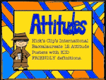

# The Period of Identity Establishment (2021- now)

During the journey of inquiry about my own identity, effective learning, and solutions to students' learning difficulties, I came across IB education by searching online forums for professional development when I saw a post by an experienced IB teacher in Shanghai introducing the differences and strengths of international education systems. I decided to sign up for the IB educator certificate after that and set forth for a brand new learnng journey that has opened my eyes with the biggest learning impact I have ever had. Connecting with my previous experience, I have found so large an amount of resonance in IB philosophical cornerstones and methodology.

Here is an example.

In my teaching experience with students from toddlers to adults in a second-tier city and a first-tier one, I have seen anxiety and pressure overwhelming students preparing for exams, and a lot of joy and freedom enlivening children studying for interest, excitement, and sense of accomplishment. I used to believe my teaching philosophy as western-style for my professional training acquired in a franchised training center with a Europe-based curriculum and EFL approaches to teaching. When I encountered a situation where my superior, as an experienced English teacher, dragged away a disobedient 6-year-old trouble-maker during a novice teacher’ class at a private training center in a top-tier city in south China in 2020, I thought there would never be an agreement between western educational philosophy and traditional Chinese counterpart because these two sets of long-existing educational systems were exclusive of each other. I somehow solved the problems of classroom management with **positive discipline** (Dr. Nelsen) two months after I took over the class when there was considerable improvement of the boy in discipline, cooperative learning, autonomous leadership, and initiative in learning.

<https://www.amazon.com/Positive-Discipline-Jane-Nelsen-EdD-audio/dp/B076FJJHC1/ref=sr_1_1?crid=3DV5SL4XHPVKH&keywords=positive+discipline&qid=1659363342&sprefix=%2Caps%2C1290&sr=8-1>

Therefore, I thought the western humanism with an emphasis on “human freedom, natural goodness, human growth and potential, personal and social values” (Sharpes, 2013, p.158) triumphed over the traditional Chinese philosophy which emphasized teacher authority and student obedience. Then I saw the possibility to integrate the two philosophies when I read George Walker’s (2010) _East is East and West is West_ forwarded by my IB instructor, after reflecting on the universal education of values for the **common good of mankind** in all educational systems, despite Walker’s acknowledgement that “international education is not truly international but developed from a very influential Western humanist tradition of learning” (p.6).

My instructor's feedback of my reflection on the experience is below.

A link to my entire journal.

<https://docs.google.com/document/d/1LpDPu2gfndcJ6MJpE2lHohhNA4qhAO1sWHOJ09Vsb6c/edit?usp=sharing>

Since I began to learn **IB educator certificate** at the University of Windsor, the inquiry about my own identity has become increasingly clear, i.e. who I am for myself, my family, my friends, my students, and my country. With some preliminary research on **international-mindedness** in the first course, the core of IB philosophy, my inquiry list kept expanding, including the relationship between the **eastern humanism** represented by Confucianism and the **western humanism**. Having been learning the MEd. at University of the People, I was able to connect more findings with each other, enabling myself to make new meanings of what I can do as an IB educator, and analyze critically the similarities and differences between **IB philosophy** and contemporary Confucianism, in the fields such as their contexts, current and future impacts, linguistic policies and teaching, and possible **integration**.

References:

Dr. Jane Nelsen, _Positive Discipline_

<https://www.positivediscipline.com/>

George Walker, 2010, _East is East and West is West_

<https://www.ibo.org/globalassets/publications/east-is-east-and-west-is-west-en.pdf>

Sharpes, D. K. (2013). Modern educational philosophies. In _Advanced educational foundations for teachers: The history, philosophy, and culture of schooling_ (pp. 399-430)

 [Home](./README.md) | [Previous Page](./philosophyc.md) |[Teaching and Learning](./teachingandlearning1.md)