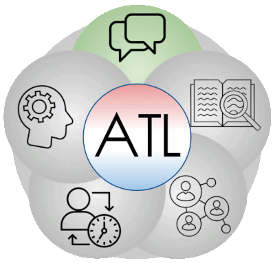

[Teaching Philosophy](./philosophya.md) | [Professional Growth](./professional.md) | [Honor](./honors.md) | [Associations](./associations.md)

# Teaching and Learning

My understanding of a teacher's roles has been developing since I practiced the **huamnistic approach** in the beginning of my teaching career, or earlier as a **service-oriented** sales, R&D, and administration manager for both my colleagues and clients, one of whom became my business partner in a startup smart-tech company with a multinational team. I think a teacher is a **facilitator** of students for their learning in both local and global context, and personal growth in life, an **engaging instructor** seeking to make learning meaningful by connecting inquiry with students' life experiences, a **life-long inquirer** for innovative pedagogy, effective practice, and changing identity, a **collaborator** and dedicated **servant for the learning community**, and above all, a **global citizen** in IB's global community.

Product Concept of The Co-developed Power Plant

Positions at the Startup Smart-tech Company

---

## Please click the arrow below to read detailed sections of teaching philosophy

<de>

 A Facilitator of Learning and Personal Growth

- [An Engaging Instructor](./teachingandlearning2.md)

+ [Collaborator and Servant for the Learning Community](./teachingandlearning3.md)

- [A Lifelong Inquirer](./teachingandlearning4.md)

+ [Differenciation and Visible Thinking Routines](./differentiatedinstruction.md)

- [Early Learning Systems](./earlylearning.md)

+ [Curriculum Development](./curriculum.md)

---

### A Facilitator of Learning and Personal Growth

### Enhancement of Students' **Agency** and **Self-efficacy**

Conceptualized by Bandura in social cognitive theory, agency “enable[s] people to play a part in their self-development, adaptation, and self-renewal with changing times” (Bandura 2001).

PYP students with agency use their own initiative and will, and take responsibility and ownership of their learning. They direct their learning with a strong sense of identity and self-belief, and in conjunction with others, thereby building a sense of community and awareness of the opinions, values and needs of others.

The 6-year-old trouble-maker boy mentioned previously drew a mind map of an English song about good hygene habits and social distancing.

He used to lack interest in learning English because of the difficult immersive classes with themes integrating different disciplines, such as the personal, social, and physical aspects, literacy, music, dance, and arts mentioned above. His mother would talk to me on Wechat at night about the problems of her son. The boy also talked to me on the phone about his homework including reading aloud the lyrics of the English songs learned in class through our homework App. Aware of his learning difficulty, I recommended him to read only one line per day. When he completed the line, I gave him high praise. Together with his mother, we used **positive discipline** to acknowledge every little effort the boy made for his further academic improvement. I found him eager to follow my words whenever possible in the class. His willingness to learn was evident when I developed a **close relationship** with him, who would call me mother secretly. His **agency** and **self-efficacy** has been developing even after I left the training center in Shenzhen, because I have been in contact with his mom.

References:

Abdur Razzaq, Yulia Tri Samiha, Muhammad Anshari, 2018, _Smartphone Habits and Behaviors in Supporting Students Self-Efficacy_

<https://www.researchgate.net/publication/323437617_Smartphone_Habits_and_Behaviors_in_Supporting_Students_Self-Efficacy>

Bandura, A. 2001. “Social cognitive theory: An agentic perspective”. _Annual Review of Psychology_. Vol 52, number 1. Pp 1–-26.

Bandura, A. 1997. _Self-efficacy: The exercise of control_. New York, NY, USA. WH Freeman and Company.

IBO, 2018, _PYP The Learner_

Matthew Brock, John M Schaefer, Rachel Seaman-Tullis, 2019, _Self-determination and Agency for All: Supporting Students with Severe Disabilities_

<https://www.researchgate.net/publication/337853271_Self-determination_and_Agency_for_All_Supporting_Students_with_Severe_Disabilities>

---

### Development of the IB **Learner Profile** and **Approaches to Learning** during **Inquiry-based** and **Concept-driven** Learning

- Approaches to Learning/Skills - (Learning & Teaching, pp. 26-39 and The Learner, pp. 15-20)

ATL consist of interconnected cognitive and metacognitive skills that support students of all ages to own their learning. These **transferrable** skills serve as means to **inquire into transdisciplinary themes** and have a **lifelong effect on learning**. Synthesization and application of these skills with **conceptual understandings** and knowledge into transdisciplinary inquiry demonstrates attributes of the IB **learner profile**. During the process, teachers should be able to pinpoint the connection between LP attributes and ATL, **personalize** and provide **authentic learning** opportunities to nurture the development of these skills. At the same time, students become **agents** by revisiting LP attributes combining ATL. It is when **teacher-student partnership** is established, with effective learning and teaching activated.

<https://learn.wab.edu/myp/atl>

---

- Learner Profile - (The Learner, p. 22-28)

The attributes of Learner Profile prepare students **intellectually, personally, socially and emotionally** to meet the challenge posed by **IB mission** to make positive changes to the world. It is IB mission in action, and can be developed, demonstrated and reinforced through **student-initiated action** facilitated inside and outside the community. The development of LP attributes in turn enhances students’ ability to respond to their inquiries. **Collaborative identification and revisiting of appropriate and relevant LP attributes** by teachers and students lead to effective learning and teaching.

<https://www.teacherspayteachers.com/Product/IB-PYP-Learner-Profile-Poster-A3A4-3265927>

---

- Action (includes agency and self-efficacy and international-mindedness) – (The Learner, pp. 1-5 and 29-39)

Within a positive and supportive **learning community**, IB students are self-motivated, self-directed and confident in their capabilities to own their learning on the **concept-based knowledge** through **sustained inquiries** into transdisciplinary themes, by taking **autonomous personal or collaborative action** on authentic issues, so that the learning community can recognize and nurture students **agency & self-efficacy** in student-teacher partnership by offering opportunities for students to develop approaches to learning and dispositions and to experience the **impact of their action in local and global contexts**. In this way, learners become more aware of their agency & self-efficacy and more engaged in positive changes to the learning community and beyond. Therefore, as the core of agency, action brings to life the **international mindedness** - the demonstration of effective learning and teaching.

<https://blog.siliconvalleyinternational.org/the-inquiry-learning-cycle>

---

I once taught an 11-year-old boy who was quite talented in music, arts, basketball, Chinese calligraphy, and STEAM model-making. Knowing about his interest in models, I introduced STEAM classes to him, such as biomimicry, energy transfer, and assembly of electronic components purchased online for model ships. The **inquiry-based** approach incorporates students' **voice and choice** into planning, which in turn improves **automous learning**, enhances **agency** and **self-efficacy**. As can be seen from the boardwork (please forgive my handwriting), the student addressed problems encountered during the experiment from different angles, which prompted him for more experiments with the help of the internet after the class. Personally speaking, I was quite amazed by his ability to **think critically and creatively**, and **persistence** for his interests. The inquiry manifested the **higher-order thinking skills** in Bloom's Taxonomy, **approaches to learning** (thinking skills, research skills, self-management skills), and attributes of the IB **learner profile** (reflective thinker, inquirer, balanced, and open-minded).

 

<https://bookunitsteacher.com/wp/?p=8498>

Here is an example of his inquiry during a STEAM class.

An Audio of His Presentation (His mother said it was a pity that he had not learned English before grade 3, so his pronunciation needed a lot more work.)

<https://pan.baidu.com/s/1qPdy6-11YrNA8vf82ppqRg?pwd=1234>

The Link to _Generation Genius_ Science Lessons

<https://www.generationgenius.com/videolessons/inspired-by-nature-biomimicry-video-for-kids/>

References:

IBO, 2018, PYP The Learner

IBO, 2018, Learning and Teaching

---

- Concept-driven Curriculum

While students are learning subject matter, transdisciplinary concepts are embedded whenever there is an opportunity.

A 6-year-old Girl's Inquiry about _Form_ during a Mathematics Class of Shapes Based on Singapore textbooks _Math in Focus_

---

 [Back](./philosophyd.md) | [An Engaging Instructor](./teachingandlearning2.md) | [A Collborator in the Learning Community](./teachingandlearning3.md)

 📧 Contact:
<175709572@qq.com>
